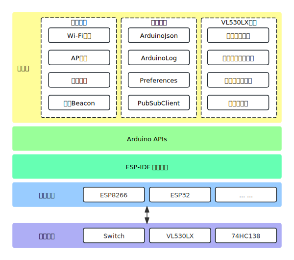

  
  
智泊无忧硬件端

## 功能
硬件端负责实时收集和处理停车场内的各类数据，为系统提供准确的车位信息和定位数据。如图所示，其架构分为应用层、Arduino APIs、ESP-IDF操作系统和硬件平台，以及外围硬件。

## 硬件连接
### ESP32作为主控，ESP8266作为通信模块（推荐）
两个设备连接方式如下：

<table>
<tr>
<th>模块</th>
<th align="center" colspan=4>引脚</th>
</tr>
<tr>
<th>ESP32</th>
<td align="center">3.3V</td>
<td align="center">GND</td>
<td align="center">GPIO16</td>
<td align="center">GPIO17</td>
</tr>
<tr>
<th>ESP8266</th>
<td align="center">3.3V</td>
<td align="center">GND</td>
<td align="center">RX</td>
<td align="center">TX</td>
</tr>
</table>

<table>
<capital>ESP32与VL53L0X的连接</capital>
<tr>
<th>模块</th>
<th align="center" colspan=4>引脚</th>
</tr>
<tr>
<th>ESP32</th>
<td align="center">3.3V</td>
<td align="center">GND</td>
<td align="center">GPIO8</td>
<td align="center">GPIO9</td>
</tr>
<tr>
<th>VL53L0X</th>
<td align="center">3.3V</td>
<td align="center">GND</td>
<td align="center">SDA</td>
<td align="center">SCL</td>
</tr>
</table>

<table>
<capital>对于一个ESP32拖多传感器，还需要额外连接以下引脚，逻辑插槽（slot）为传感器编号，用于ESP模块的识别和显示在后台</capital>
<tr>
<th></th>
<th align="center" colspan=5>引脚</th>
</tr>
<tr>
<th>VL53L0X</th>
<td align="center" colspan=5>XSHUT</td>
</tr>
<tr>
<tr>
<th>ESP32</th>
<td align="center">GPIO1</td>
<td align="center">GPIO2</td>
<td align="center">GPIO3</td>
<td align="center">GPIO18</td>
<td align="center">......</td>
</tr>
<th>逻辑插槽（slot）</th>
<td align="center">0</td>
<td align="center">1</td>
<td align="center">2</td>
<td align="center">3</td>
<td align="center">......</td>
</tr>
</table>